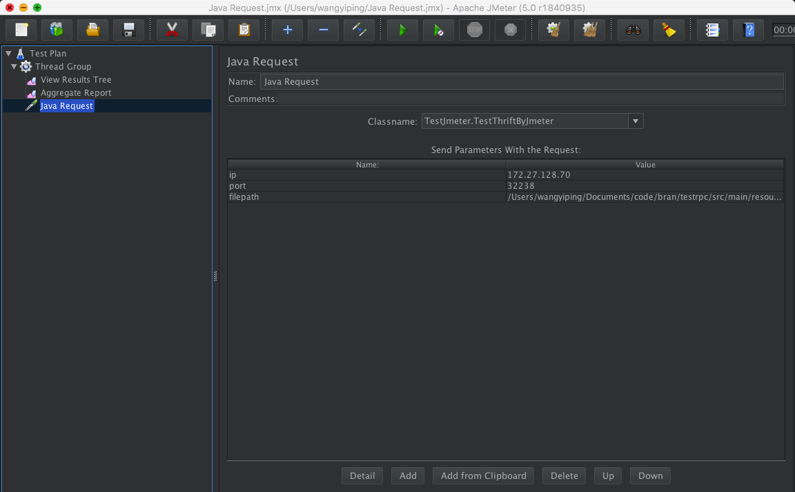

# jmeter-testrpc
use jmeter test rpc service


将依赖的jar包和本身的jar包，拷贝到jmeter的lib/ext目录下
```bash
mvn dependency:copy-dependencies -DoutputDirectory=lib  
cp -r lib/* ~/Documents/tools/apache-jmeter-5.0/lib/ext      
mvn clean package -U -DskipTests 
cp target/testrpc-1.0-SNAPSHOT.jar ~/Documents/tools/apache-jmeter-5.0/lib/ext
```

jmeter示例图如下

